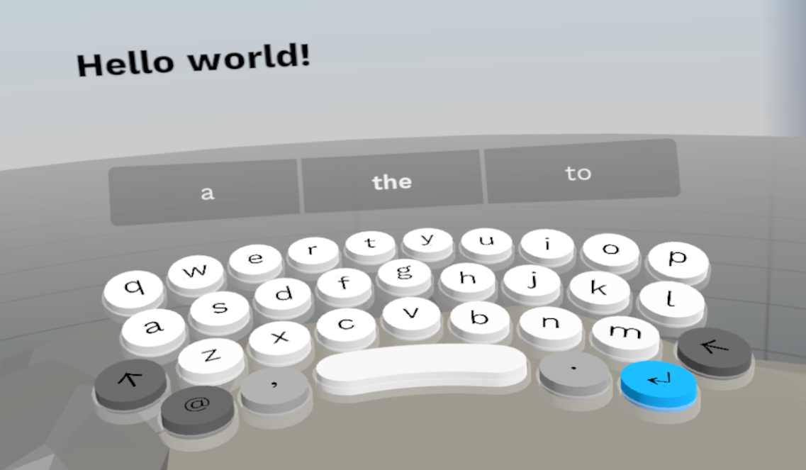
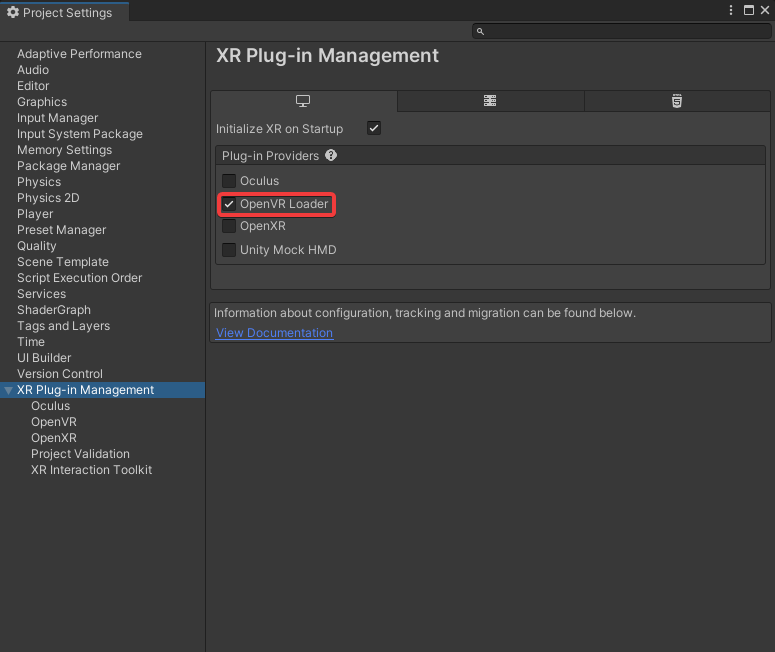
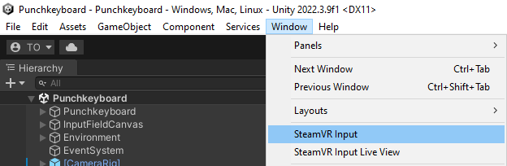
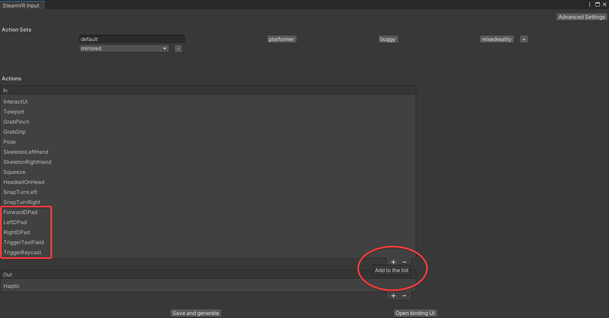
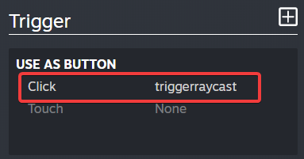
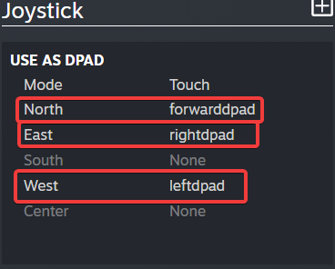
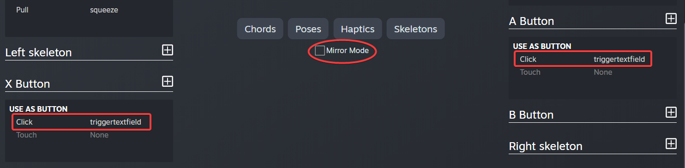

# XR Slate - Extended Reality Swiping Layout Adjustment for Text Entry

## Table of Contents
- [Introduction](#introduction)
- [Getting Started](#getting-started)
  - [Prerequisites](#prerequisites)
  - [Installation](#installation)
- [Usage](#usage)
- [Contributing](#contributing)
- [License](#license)

## Introduction



XR Slate is an innovative extended reality (XR) text entry system that utilizes swiping gestures to adjust the layout for text entry in virtual environments. This project aims to improve the efficiency and user experience of text input in XR applications, making it more accessible and intuitive.

This codebase is based on the Punchkeyboard project, which can be found at [GitHub - Punchkeyboard](https://github.com/rjth/Punchkeyboard). It retains the drumming typing experience of Punchkeyboard and adds swiping gestures for enhanced text input in XR.

## Getting Started

### Prerequisites

Before you begin, ensure you have met the following requirements:

- [Unity](https://unity.com) - Set up your Unity development environment. XR Slate is compatible with Unity, making it an ideal choice for XR application development.

- OpenVR Loader - XR Slate uses OpenVR for XR device compatibility. Make sure to install and configure the OpenVR Loader in your Unity project.



- [SteamVR Plugin](https://store.steampowered.com/app/250820/SteamVR/) - XR Slate is compatible with the SteamVR plugin for enhanced XR functionality. Make sure to install and configure the SteamVR Plugin in your Unity project.


### Installation

1. Open the XR Slate project in Unity.

2. In the Unity Editor, navigate to **Window** -> **SteamVR Input**.

   

3. Ensure that the following actions are added to your project. If they are not already present, add them:
   - ForwardDPad
   - LeftDPad
   - RightDPad
   - TriggerTextField
   - TriggerRaycast

   

4. Open the binding UI in the SteamVR Input window.

5. Add **TriggerRaycast** to the **Trigger** input action.

   

6. Map the joystick D-Pad as follows:
   - **North** - ForwardDPad
   - **East** - RightDPad
   - **West** - LeftDPad

   

7. (Optional) If you want to disable mirror mode, you can do so in the SteamVR settings.

8. Bind the **X** button on the left controller and the **A** button on the right controller to the **TriggerTextField** action.

   

## Contributing

Contributions from the open-source community are welcome. To contribute to XR Slate, please follow these steps:

1. Fork this repository.

2. Create a new branch for your feature or bug fix:

   ```bash
   git checkout -b feature/your-feature
   ```

3. Commit your changes:

   ```bash
   git commit -m 'Add new feature'
   ```

4. Push to your fork:

   ```bash
   git push origin feature/your-feature
   ```

5. Open a pull request to the main repository.

## License

This project is licensed under the [MIT License](LICENSE.txt).